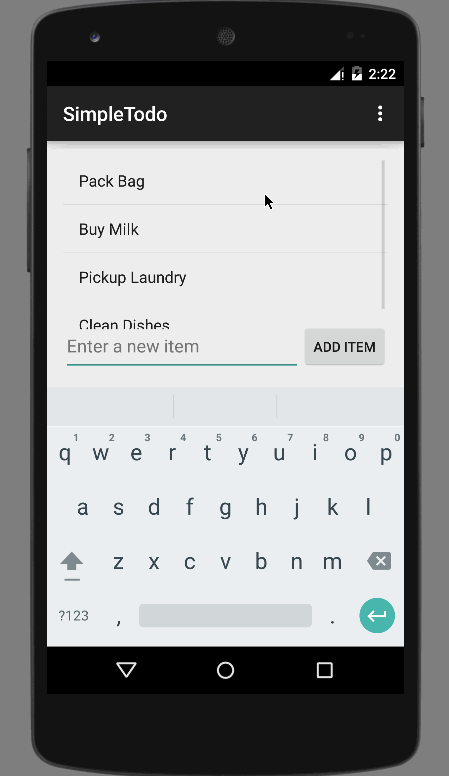

# Simple To Do List Demo

This is an Android demo application for managing a simple ToDo list. See the [Android Pre-work: Todo App](http://courses.codepath.com/snippets/intro_to_android/prework) for a step-by-step tutorial.

Time spent: 5 hours spent in total

Completed user stories:

 * [x] Required: Successfully add and remove items from the todo list
 * [x] Required: Include support for editing todo items
 * [x] Required: Persist todo items and retrieve them properly on app restart
 * [x] Required: Successfully pushed the source code to github
 * [x] Required: Add a README which includes a GIF walkthrough (ToDo.gif) of the app's functionality
 * [x] Required: Create an issue on the repo and include /cc @codepathreview @codepath in the issue body

Notes:

GIF created with [LiceCap](http://www.cockos.com/licecap/).
